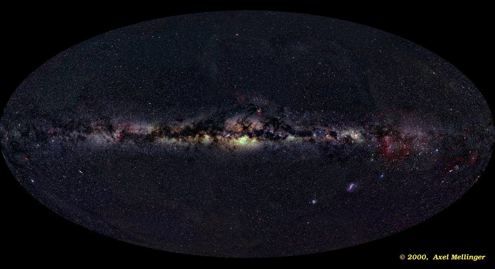
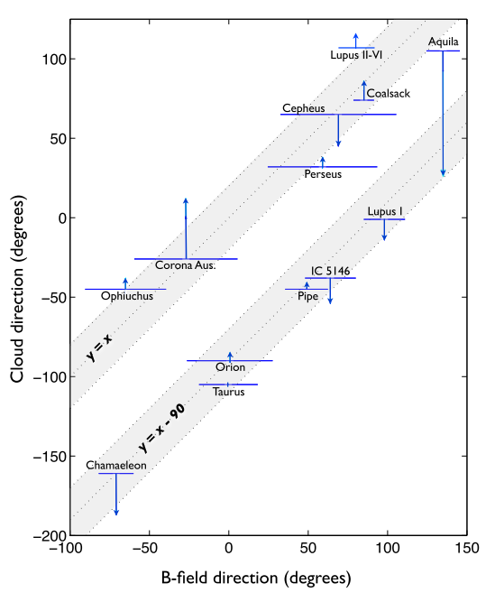
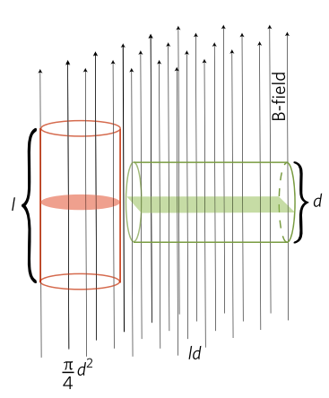
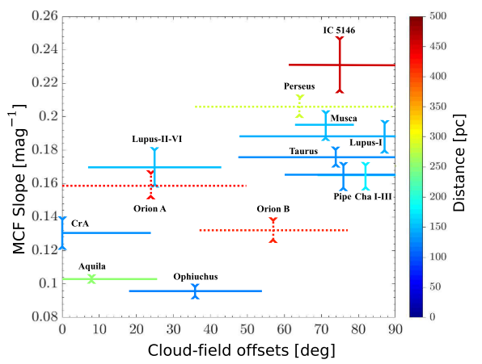

    

    

    

    

    

    

    

    <h3>Project Presentation</h3>
    <h1>Possible Existence of Parallel Oriented Molecular Cloud in Gould Belt in Numerical Aspect</h1>
       
    

        

            <small class='left'>MPhil student @ CUHK</small>
            <small>Tsang Man Hin</small>
        

        

            <small class='left'>Supervisor @ CUHK</small>
            <small>Prof. Li, Hua Bai</small>
        

        <small>30 June 2022</small>
    

---

    

    

    

    

    

    

    

<h4>Stars</h4>

    
    <small>Image adoped from Helioviewer.org</small>

<!--
    - funcamental building blocks of the astronomical objects.
    - ages clusters
    - distributions & composition trace the history of the galaxy.
    - HR diagram -> ages of clusters.
    - Giant fusion reactor - pp chain, CNO cycles, 
    - 
-->

 
 

    
    <input type="checkbox" id="cb1-1" />
    <label for="cb1-1">Atom of the universe <small>(Mckee, 2017)</small></label>

 

    
    <input type="checkbox" id="cb1-2" />
    <label for="cb1-2">Origin ?</label>

<!-- 

    
    <input type="checkbox" id="cb2" />
    <label for="cb2"></label>

 -->

---

    

    

    

    

    

    

    

<h4>Inter staller Medium</h4>

    

<!-- 
    - Gas filling the space
    - Hydrogen, atoms molecules or ions.
    - Dust.
    - Ions -> H II emission, (n = 3 -> 2: red) (n = 4 -> 2: blue).
    - Atoms -> H I region (wavelength = 21 cm) (spin flip)
    - Molecules -> didn't emit -> observe CO emission line (2.6 mm).
 -->

 
 

    
    <input type="checkbox" id="cb2-1" />
    <label for="cb2-1">Gas filling the space</label>

 
<!-- 

    
    <input type="checkbox" id="cb2-2" />
    <label for="cb2-2">Origin ?</label>

 -->

---

    

    

    

    

    

    

    

<h4>Molecular Cloud</h4>

    
    <figcaption>Herschel 250 µm dust emission map of Musca <small>(A. Tritsis & K. Tassis, 2018)</small>
    </figcaption>

<!-- 
    - Dense and cold gas, composite of molecules.
    - Hydrogen, atoms molecules or ions.
 -->

 
 

    
    <input type="checkbox" id="cb3-1" />
    <label for="cb3-1">Elongated</label>

 

    
    <input type="checkbox" id="cb3-2" />
    <label for="cb3-2">Magnetized</label>

 

    
    <input type="checkbox" id="cb3-3" />
    <label for="cb3-3">Turbulent</label>

---

    

    

    

    

    

    

    

<h4>Magnetic Field</h4>

    

        
        <figcaption>Musca <small>(ESA/Herschel/Planck; J. D. Soler, MPIA)</small>
        </figcaption>
    

    

        
        <figcaption>Taurus <small>(ESA/Herschel/Planck; J. D. Soler, MPIA)</small>
        </figcaption>
    

<!-- 
    - Dense and cold gas, composite of molecules.
    - Herschel 250, 350, 500 microns
    - PLANCK - Magnetic field.
 -->
 
 

    
    <input type="checkbox" id="cb4-1" />
    <label for="cb4-1">Ordered</label>

---

    

    

    

    

    

    

    

<h4>Turbulent</h4> 

 
 

    
    <input type="checkbox" id="cb5-1" />
    <label for="cb5-1">Emittion line width (FWHM ~ km/s) </label>

 

    
    <input type="checkbox" id="cb5-2" />
    <label for="cb5-2">Larson's relation σ ∝ POW(L, 0.38) </label>

 <!-- Too Basic -->

<!-- - What is ISM. & Molecular cloud (big picture).

- Base to build the research.

- Elongated properties of MC. (Examples, from PLANCK | QL) (-> idea to study the long-axis orientation.)

- Turbulent & Magnetic field (Examples, shows some figures).

- linewidth observed is much wider then thermal emission (~10K), preventing from cloud from free-falling.

- Gas pressure is some how isotropic, but not for the magnetic field pressure. 

- B-field (ordered) & elongated -> something to do to the SFE. (Li 2017)
 -->

---

    

    

    

    

    

    

    

<h4>Motivation</h4> 

 
 

    
    <input type="checkbox" id="cb6-1"/>
    <label for="cb6-1">Correlation between MCs orientation & b-field direction ?</label>

 

    
    <input type="checkbox" id="cb6-2" />
    <label for="cb6-2">Does parallel orientated molecular cloud could explain the result better?</label>

---

    

    

    

    

    

    

    

<h4>Bimodal Cloud Orientation</h4> 

    
    <figcaption>
        Cloud versus B-field directions
    </figcaption>
    <small>
        Adopted from Li, Fang, Henning & Kainulainen (2013)
    </small>
    

 
 

    
    <input type="checkbox" id="cb8-1"/>
    <label for="cb8-1">
        Study of the Gould Belt MCs.
    </label>

 

    
    <input type="checkbox" id="cb8-2" />
    <label for="cb8-2" style="max-width: 60%;"> 
        Cloud alignment - autocorrelation contour of the extinction map.
    </label>

 

    
    <input type="checkbox" id="cb8-3" />
    <label for="cb8-3" style="max-width: 60%;"> 
        B-field alignment - equal weight Stokes mean. 
        <small>Optical polarimetry data Heiles (2000)</small>
    </label>

<!-- 
    IRAS-based extinction maps 
        from Schlegel, Finkbeiner & Davis (SFD; 1998)
    
    near-infrared color-excess 2MASS-based extinction maps 
        from Rowles & Froebrich (RF; 2009)
        and from Dobashi (2011).
 -->

---

    

    

    

    

    

    

    

    
    <figcaption>
        Pipe nebula (left) and Ophichus (right) with B-field overlapped.
    </figcaption>
    <small>
        Adopted from Li, Jiang, Fan, Gu & Zhang (2017),  background: ESO/S Guisard
    </small>
    <small>
        Red: Alves, Franco & Girart (2008), Yellow: Heiles (2000)
    </small>

--- 

    

    

    

    

    

    

    

<h4 style="max-width: 65%">Magnetic flux for different cloud alignment</h4>

    
    <figcaption style="text-align: center;">
        Illustration of magnetic flux vary with filamentary cloud orientation.
    </figcaption>
    <small>
        Adopted from Li, Jiang, Fan, Gu & Zhang (2017)
    </small>

 
 

    
    <input type="checkbox" id="cb10-1"/>
    <label for="cb10-1">
        Different of cross-section area.
    </label>

 

    
    <input type="checkbox" id="cb10-2" />
    <label for="cb10-2" style="max-width: 60%;"> 
        ∥: smaller flux, ⟂: larger flux.
    </label>

 

    
    <input type="checkbox" id="cb10-3" />
    <label for="cb10-3" style="max-width: 60%;"> 
        Different collapsing efficiency?
    </label>

--- 

    

    

    

    

    

    

    

<h4 style="">Effect of Alignment on Mass Cumulative Functions</h4>

    
    <figcaption style="text-align: center; max-width: 80%;">
        MCF of 13 Gould Belt MCs.
    </figcaption>
    <small>
        Adopted from Law (2020)
    </small>

 

 Mass Cumulative function (MCF) 

$$MCF(\tilde A_V)\;=\;\mu m_H C \sum_{A_V > \tilde A_V} A_V \times A_{pixel}$$

 

 MCF Slope 

$$MCF.Slope = \frac{1}{|A_{Vtrs} - A_{V 10\%}|}$$

 

    ↑ MCF Slope  → more mass accumulate at the high dense region

---

    

    

    

    

    

    

    

<h4 style="">Effect of Alignment on MCF cont'd</h4>

    
    <figcaption style="text-align: center; max-width: 80%;">
        MCF Slope versus cloud-field offset of 13 Gould Belt MCs.
    </figcaption>
    <small>
        Adopted from Law (2020)
    </small>

 
 

    
    <input type="checkbox" id="cb12-1"/>
    <label for="cb12-1">
        ↑ offset → ↑ MCF Slope
    </label>

 

    
    <input type="checkbox" id="cb12-2" />
    <label for="cb12-2" style="max-width: 60%;"> 
        Statistically significant (p-value = 0.01)
    </label>

 

    
    <input type="checkbox" id="cb12-3" />
    <label for="cb12-3" style="max-width: 60%;"> 
        Projection effect!
    </label>

---

    

    

    

    

    

    

    

<h4 style="">Effect of Alignment on Star Formation Efficiency <small>Li(2017)</small></h4>

    
    <figcaption style="text-align: center; max-width: 80%;">
        SFE versus cloud-field offset of 13 Gould Belt MCs.
    </figcaption>
    <small>
        Adopted from Li (2017)
    </small>

 

<h3 style="margin-bottom: 1rem !important;">SFR estimated by</h3>
    
$$ 
SFR = N_{YSO} \times \frac{Median-mass}{0.5 M_{\odot}} \times 
\left(\frac{Typical-age}{2 Myr} \right)^{-1}
$$

 

<h3>SFR rate-1 (SFE) estimated by</h3>

- SFR divided by cloud mass
    - Mass above $A_V = 2$ mag for Ref 4
    - Mass above $A_V = 7$ mag for Ref 3

---

    

    

    

    

    

    

    

# Our Goal

 

    
    <input type="checkbox" id="cb14-1"/>
    <label for="cb14-1" style="max-width: 100%;">
        Offset is caused by projections.
    </label>

 

    
    <input type="checkbox" id="cb14-2" />
    <label for="cb14-2" style="max-width: 100%;">
        Best fit of the observed result including parallel clouds.
    </label>

 

    
    <input type="checkbox" id="cb14-3" />
    <label for="cb14-3" style="max-width: 100%;">
        Statistical analysis with MHD simulated result. 
    </label>

---

    

    

    

    

    

    

    

    
    <figcaption style="display:flex; flex-direction: column; align-items: center;">
        Example test case - OT vortex<small> (Orszag & Tang, 1998)</small>
        <a href="http://sfg.phy.cuhk.edu.hk/group_page/scorpio.php"><small>
            find more test cases in sfg.phy.cuhk.edu.hk/group_page/scorpio.php
        </small></a>
    </figcaption>

# MHD simulation

 

Scorpio

 

    
    <input type="checkbox" id="cb15-1"/>
    <label for="cb15-1" style="max-width: 100%;">
        Initiated by Hsiang-Hsu Wang
    </label>

 

    
    <input type="checkbox" id="cb15-2" />
    <label for="cb15-2" style="max-width: 100%;">
        Two fulid MHD-AD solver
    </label>

 

    
    <input type="checkbox" id="cb15-3" />
    <label for="cb15-3" style="max-width: 40%;">
        Open source & publication in the future
    </label>

---

    

    

    

    

    

    

    

# Initial conditions

    
    <figcaption>
        Initial column density of the clouds.
    </figcaption>

 
 
 
 
 

- $960 \times 480^2$ grid cells $20 \times 10^2$ pc3 box.
    - cloud scales ~ 10 pc.

- Plammer Profile
    - $\rho(r) = \rho_c \left( 1 + r^2/a^2\right) ^{-p/2}$ 
    - $p = 2$, $a = 2.5$ pc,  $\rho_c=57.5$ M$_⊙$ pc$^{−3}=1110$ cc$^{−1}$
     - exponential decay at $r > \pm 7.5$ pc, $\rho_{min} = 0.2 \rho_c$  

---

    

    

    

    

    

    

    

#### Initial conditions cont'd.

 

- Equipartition of energy - $KE = U_G = U_B$

- Mach number 10 at the ~10 pc scale 
- $T = 25$ K, $\mu = 2.3$ ~ typical value of MC.
- $|\vec{B}| = 20.79$ 𝜇𝐺
- identical initial turb velocity field $P(k) \propto k^{-2} \{k \geq 5\}, 0 \{k < 5\}$.

---

    

    

    

    

    

    

    

#### Simulation result

    
    <figcaption>
        Column density at the end of the simulation
    </figcaption>

 

    
    <input type="checkbox" id="cb18-1"/>
    <label for="cb18-1" style="max-width: 100%;">
        End at 1.58 Myr
    </label>

    
    <input type="checkbox" id="cb18-2" />
    <label for="cb18-2" style="max-width: 100%;">
        
Projections

        <ul>
            <li>10000 times each</li>
            <li>Random & uniform (Fibonacci Lattice)</li>
            <li>Equal mass maximum closed contour</li>
        </ul>
    </label>

    
    <input type="checkbox" id="cb18-3" />
    <label for="cb18-3" style="max-width: 100%;">
        
Generate observables

        <ul>
            <li>Orientations of cloud and b-field</li>
            <li>MCF Slope</li>
            <li>Estimate SFE by dense gas fraction</li>
        </ul>
    </label>

---

    

    

    

    

    

    

    

#### Orientations

    
    <figcaption style="display:flex; flex-direction: column; align-items: center;">
    
Cloud orientation (red line)

    
Mean b-field direction (Black arrow)

    </figcaption>

 

Cloud orientation

    
    <input type="checkbox" id="cb19-1"/>
    <label for="cb19-1" style="max-width: 60%; font-size: 0.8em;">
        Column density weighted principle component 
    </label>

 

Mean B-field direction 

    
    <input type="checkbox" id="cb19-2" />
    <label for="cb19-2" style="max-width: 100%; font-size: 0.8em;">
        Density weighted Stoke's mean
    </label>

---

    

    

    

    

    

    

    

#### Orientations cont'd.

 
 

    
    <input type="checkbox" id="cb20-1"/>
    <label for="cb20-1" style="max-width: 90%;">
        9934/10000 parallel cloud's projections with offset smaller than 45 deg
    </label>

 

    
    <input type="checkbox" id="cb20-2" />
    <label for="cb20-2" style="max-width: 100%;"> 
        3051/10000 perpendicular cloud's projections with offset smaller than 45 deg
    </label>

---

    

    

    

    

    

    

    

#### Orientations analysis

 

Compare with $13$ Gould belt MCs in Li(2017, 2013) and Law(2020) 
$5$ clouds are parallel, and $8$ clouds are perpendicular to the b-field.

- Assume $k$ clouds in 13 is intrinsically parallel, 
    - select $k$ projection from intrinsically parallel cloud.
    - select $13 - k$ projection from intrinsically perpendicular cloud.
    - relative likelihood of $k$ to see the observed propotion (5:8)

---

    

    

    

    

    

    

    

#### Orientations analysis cond't

 

    
    <figcaption>
        Result of the orientation test.
    <small></small>
    </figcaption>

- Maximum likelihood estimate of $k$ is
    - $k = 2 \in [0, 5]$ for PLANCK data

 

- Maximum likelihood estimate of $k$ is
    - $k = 4 \in [0, 6]$ for starlight data

---

    

    

    

    

    

    

    

#### MCF Slope

    
    <figcaption style="display:flex; flex-direction: column; align-items: center;">
    
5 randomly selected MCF from the two simulated clouds

    </figcaption>

 

Law, 2020 MCF Slope $= \frac{1}{|A_{Vtrs} - A_{V 10\%}|}$

    
    <input type="checkbox" id="cb23-1"/>
    <label for="cb23-1" style="max-width: 60%; font-size: 0.8em;">
        Turning point is not resolved in our simulation 
    </label>

Our simulation:  MCF Slope $= \frac{1}{|\sigma_{min} - \sigma_{10\%}|}$

    
    <input type="checkbox" id="cb23-2" />
    <label for="cb23-2" style="max-width: 100%; font-size: 0.8em;">
        similar trends as Law (2020)
    </label>

---

    

    

    

    

    

    

    

# Intuition

    

        
        <figcaption> 
            MCF of 13 Gould belt MCs.    
        <small>Law (2020)</small>
        </figcaption>
    

    

        
        <figcaption>
            5 randomly selected MCF from the two simulated clouds
        </figcaption>
    

        
Larger offset trend to have a more flatten MCF.

---

    

    

    

    

    

    

    

# MCF Slope cont'd

    
    <figcaption>
        MCF Slope versus cloud-field offset
    </figcaption>

 

    
    <input type="checkbox" id="cb22-1" />
    <label for="cb22-1" style="max-width: 100%;"> 
        ↑ offset → ↑ MCF Slope
    </label>

 

    
    <input type="checkbox" id="cb22-2" />
    <label for="cb22-2" style="max-width: 40%;"> 
        small variation of offset for intrinsically parllel cloud
    </label>

 

    
    <input type="checkbox" id="cb22-3" />
    <label for="cb22-3" style="max-width: 40%;"> 
        smaller MCF slope for intrinsically parllel cloud
    </label>

---

    

    

    

    

    

    

    

# MCF Slope Analysis

 

- Calculate mean MCF slope $\theta$ > 45 - mean MCF slope $\theta$ < 45 based on the observation (Relative MCF slope difference)

- Assume $k$ over 13 clouds is intrinsically parallel, 
    - select $k$ projection from intrinsically parallel cloud.
    - select $13 - k$ projection from intrinsically perpendicular cloud.
    - calculate Relative MCF slope difference
    - repeat 10000 times to estimate the likelihood to reach the observed value. 

---

    

    

    

    

    

    

    

    
    <figcaption>
        MCF test's bootstrapped result.
    </figcaption>

# MCF Slope Analysis Result

 

- Maximum likelihood estimate of $k$ is
    - $k = 5 \in [0, 12]$ for PLANCK data

 

- Maximum likelihood estimate of $k$ is
    - $k = 3 \in [0, 11]$ for starlight data

---

    

    

    

    

    

    

    

    
    <figcaption>
    </figcaption>

---

    

    

    

    

    

    

    

    
    <figcaption>
    </figcaption>

---

    

    

    

    

    

    

    

# DGF Analysis Cont'd.

 

- Calculate mean SFE $\theta$ > 45 - mean SFE $\theta$ < 45 based on the observation (Relative SFE difference, Li 2017)

- Assume $k$ over 13 clouds is intrinsically parallel, 
    - select $k$ projection from intrinsically parallel cloud.
    - select $13 - k$ projection from intrinsically perpendicular cloud.
    - calculate Relative DGF slope difference
    - repeat 10000 times to estimate the likelihood to reach the observed SFE difference. 

---

    

    

    

    

    

    

    

    
    <figcaption>
        DGF test's bootstrapped result.
    </figcaption>

# DGF Analysis Result

 

- Maximum likelihood estimate of $k$ is
    - $k = 10 \in [1, 12]$ for PLANCK data

 

- Maximum likelihood estimate of $k$ is
    - $k = 9 \in [1, 11]$ for starlight data

---

    

    

    

    

    

    

    

    
    <figcaption>
        DGF test's bootstrapped result.
    </figcaption>

# Total Likelihood

 

- Maximum likelihood estimate of $k$ is
    - $k = 2 \in [1, 5]$ for PLANCK data

 

- Maximum likelihood estimate of $k$ is
    - $k = 4 \in [1, 6]$ for starlight data

---

    

    

    

    

    

    

    

#### Discussion 

 
 

    
    <input type="checkbox" id="cb33-1"/>
    <label for="cb33-1" style="max-width: 100%;">
        Estimation of DGF
    </label>

 

    
    <input type="checkbox" id="cb33-2" />
    <label for="cb33-2" style="max-width: 100%;">
        Contridiction with S&W 2015
    </label>

 

    
    <input type="checkbox" id="cb33-3" />
    <label for="cb33-3" style="max-width: 100%;"> 
        Non log-normal
    </label>

---

    

    

    

    

    

    

    

    
Thank You!

---

    

    

    

    

    

    

    

    

---

    

    

    

    

    

    

    

    

---

    

    

    

    

    

    

    

    

---

<!-- 
#### Discussion 

Why Solar can't see the Li17 trends.

- Density threshold.

(Go through this paper)

- Solar use the density threshold above the critical density $A_V = 8$, a range that cloud mass is linearly correlated with the star-formation rate.

    - Li 2017 analyzed using cloud mass above $A_V= 2$, not only focusing on the high density region.

--- 

Collisional Coefficient. (WG Appendix)
Drag force term.

WG-tests with realistic collisional coefficient (inconsistence result) 
Too big friction (drag) force pointing outward. (not collapsing)

 Same result if repeating Balsara's result. (Teley) (1/2 order smaller)

Ask's ZY opinion.

Draine 1986. (realistic value)

Same problems in Tilley & Balsare see if real collision coef 

A numerical scheme and benchmark tests for non-isothermal two-fluid
ambipolar diffusion
David A. Tilley
, Dinshaw S. Balsara, Chad Meyer

New Astronomy 17 (2012) 368–376

---

Goal of the paper.

reperform SW15 paper, Scale with the observed cloud.

Observe the MCF slope and SFE from the simulated observation.

Comparing this with the observation and judge the most propably ratio between para and perp

---

#### References

A. Tritsis, K. Tassis, Magnetic seismology of interstellar gas clouds: Unveiling a hidden dimension. Science 360, 635-638 (2018) -->